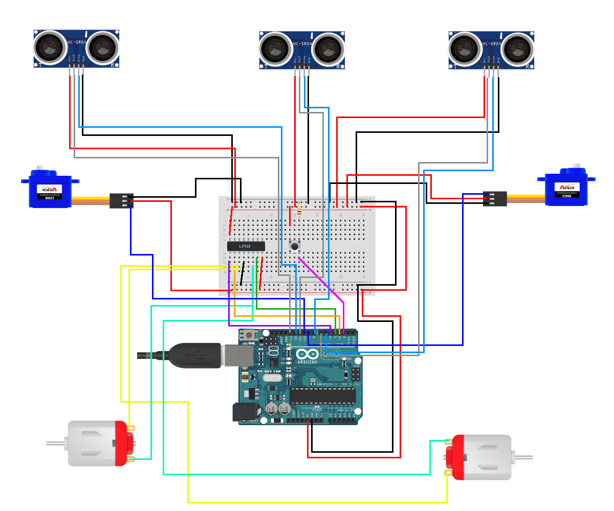

# Degree - Robot

 

Developed by Christian Visintin

- [Degree - Robot](#degree---robot)
  - [Introduction](#introduction)
  - [Project Description](#project-description)
  - [Project Circuit](#project-circuit)
    - [Circuit Components](#circuit-components)
    - [Circuit Scheme](#circuit-scheme)
  - [License](#license)

---

## Introduction

This repository contains the (refactored) source code and the project I made for my IT degree in 2016.
I refactored the source code since it was really bad written, even if written with the best intentions and it actually worked pretty well.

## Project Description

From my thesis (which was about AI) - *well actually is translated from italian at 10PM, so it's not very well written*:

> Starting from the Artificial Intelligence concept, I made a practical project where I implemented it
> The project consists in a robot vehicle made up of 4 wheels, of which 2 can stear while the other two have a DC engine, 2 servos placed on the front wheels to stead and 3 distance sensors placed on front.
> Everything is then controlled by an Arduino UNO board and powered by a 10,000 mA/h Lithium Battery (powerbank) connected to the board through USB, with a throughput of 2.1A.
> The robot, thanks to its distance sensor is capable of learning how the space in front and around of it, is structured and is then able to avoid obstacles, choosing the best direction.
> The memorization of the space structure it takes place through a 3 columns matrix (one column for each sensor); every 500 milliseconds the space detected distance, expressed in centimeters, is stored in the matrix; old records are shifted back by one position.
> The robot goes always straight on, until an obstacle is detected in front of the vehicle with a distance less than 50cm.
> If an obstacle is detected the vehicle steers right or left based on the distances recorded on both sides, and steers in the direction with more space available.
> If the space between the vehicle and the obstacle in front of it, is less than 15cm, it will go backward for a certain time in order to prevent structural damages.

TL;DR: a robot vehicle which, thanks to its distance sensor is able to learn how the space is made and then is able to avoid obstacles. Like a hoover robot.

Some picture of the device:

Front

Top

Yes I know, this is a perfect example of *spaghetti-wires*.

---

## Project Circuit

### Circuit Components

These components are required:

- 2 DC motors
- 2 Continuous Rotation Micro Servo - FS90R
- 3 Ultrasonic Sensor - HC-SR04
- 1 L293D Motor Driver
- 1 Mini Pushbutton Switch
- 1 10K Ohm Resistor
- 1 Arduino UNO Rev. 3
- 1 PowerBank 10,000 mA/h

### Circuit Scheme

---

## License

View [LICENSE](LICENSE.txt)
